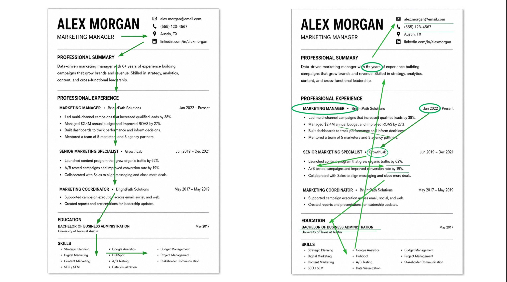
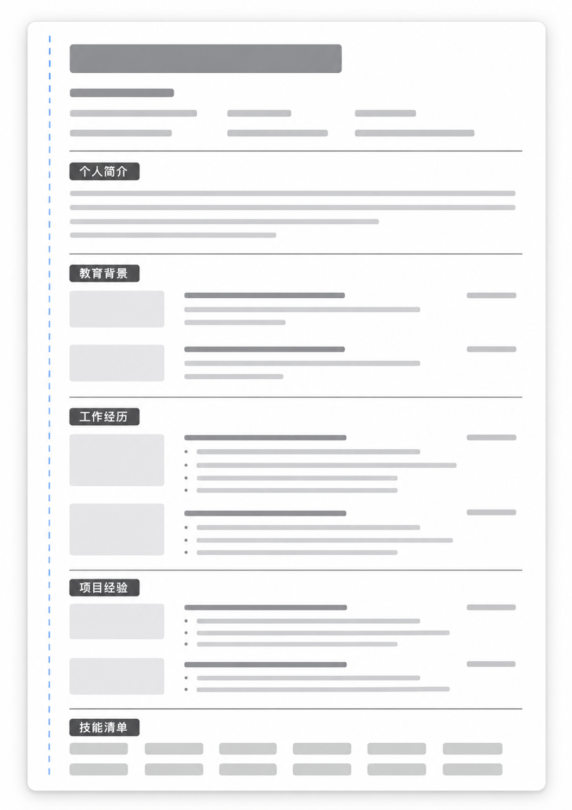

# 新手如何写简历？

写一份好的简历是求职的入场劵。但判断一份简历的质量并不容易，一方面，我们自己写自己的简历，多少都一定会“自我感觉良好”，毕竟那是自己花了很长时间打磨出来的作品；另一方面，HR的视角跟求职者很不同，关注点也会不一样。更重要的是，似乎很难有评判标准让我门来审视自己的简历。本文自然有没有能力制定出这样的标准，但在总结经验和跟，尝试提出三个视角，来指导求职者写出一份面向HR的简历。

## 一、排版：为扫读设计

既然要面向 HR，我们必须首先搞清楚 HR 如何读一份简历。为此，我们不妨换位思考一下，假如我们是 HR 来读**一份**简历，会怎么读？

我们当然可以可以从头读到尾，认真看每一句话。可如果待处理的是几十份甚至上百份，阅读方式一定会改变。后者就是HR的工作。

因此，我们几乎可以肯定 HR 往往先扫读（scan），而不是阅读（read），更不是精读（scrutinize）。HR的视线会寻找职位、公司、行业以及职位描述里反复出现的关键词。只有看到相关信号，才会停下来细看；如果几秒之内没有找到，阅读很可能就结束了。

这不是招聘者不尊重候选人，而是工作量和专业能力决定了阅读方式。

于是，我们得到了第一个原则：

> **简历应该为扫读设计，而不是预设HR一上来就会逐字阅读。**

更精细一点，其实应该是为在显示器上的扫读而设计，这本质上跟我们浏览一个网页没什么不同。

适合在显示器上扫读的排版，主要依赖三个朴素的原则：邻近、对齐、重复。

### 邻近

属于同一组的信息应该靠近，不同组之间应该拉开。同一段工作经历中的公司、职位、时间和项目符号要形成一个视觉整体；两段经历之间的距离应该大于同一段内部的行距；教育、工作、项目和技能等板块之间，则需要更明显的分隔。即使暂时看不清文字，读者也应当能通过空间判断信息分组。

### 对齐

同一类信息应该共用一条左/右边线，公司名和职位采用稳定的层级，日期统一放在右侧。读完第一段经历后，读者的眼睛会形成预期：去哪里找公司，去哪里找时间，去哪里找成果。后面的版面不要让他重新学习。

### 重复

邻近和对齐规则建立后，就重复使用。相同层级使用相同字号，相同类型的日期采用相同格式，项目符号、缩进和行距保持一致。

至于颜色、图标、技能进度条和复杂的多栏设计，要谨慎使用。它们可能好看，却也可能抢走注意力、制造难以比较的尺度，甚至影响招聘系统解析文本。对大多数岗位而言，清楚、稳定、可复制的版式已经足够。

## 二、表述：降低不确定性

排版的问题解决之后，我们就要进一步考虑内容。HR 能顺利找到一段经历，当然很好，但看到以后，能不能理解这段经历，又是另一回事。这就涉及到我们要讨论的第二个问题：表述。

在讨论怎么表述之前，我们不妨先明确两个事实：第一，简历是给 HR 看的；第二，HR 看的时候，我们通常不在场。

这两件事听起来似乎都是废话，但如果往下想一步，就会发现，它们对简历的表述有很具体的要求。

既然简历是给 HR 看的，我们就要考虑对方怎么接收信息。自己知道做过什么，并不意味着对方看完也能知道。比如，我们写“负责项目推进”，自己可能很清楚这个项目有多复杂、推进起来有多困难，可 HR 只看到了六个字。

而且，HR 看的时候，我们通常不在场。如果是面试，对方可以追问，我们也可以补充解释；但在筛选简历的时候，对方很少会因为某句话没看懂，专门来问我们到底是什么意思。

于是，这两个事实结合起来，我们可以得到一个结论：

> **简历是一次从对方出发的单向沟通。**

为了看清这种沟通有什么特别，我们可以把“从谁出发”和“能否来回交流”放在一起，作一个简单的比较：

| | 单向沟通 | 双向沟通 |
| --- | --- | --- |
| 从自己出发 | 日记、表达个人感受的朋友圈 | 倾诉、表达自己立场的争论 |
| 从对方出发 | 简历、说明书 | 协商、谈判 |

写日记的时候，我们可以写得具体，也可以含糊一些，毕竟不需要让某个特定的人准确理解。协商、谈判则不同，我们需要对方理解，但好在可以来回交流：哪里没讲清楚，就再讲一次；哪里有误解，就补充解释。

简历恰好把两个不太方便的条件放在了一起：一方面，我们很需要 HR 理解；另一方面，我们又没有随时补充解释的机会。如果表述本身存在歧义，就只能由 HR 自己判断，而对方未必有时间，也未必有足够的背景知识替我们判断。

因此，我们得到了第二个原则：

> **简历的表述应该降低不确定性。**

这里的不确定性，其实就是对方读完以后，仍然搞不清楚的那些事情。比如，“参与”究竟参与了什么？“负责”负责到了什么程度？“效果良好”又到底有多好？这些问题如果没有答案，HR 就很难判断这段经历能说明什么。

那么，怎么降低这种不确定性？主要可以把握两点：数字大于形容词，具体大于抽象。

### 数字大于形容词

形容词往往没有统一的尺度。比如，“顾客很满意我们的产品”，我们当然知道这是一个正面的评价，但多满意才算“很满意”？是有人口头夸了一句，还是大部分人都愿意继续购买？只看这句话，我们无法判断。

假设实际的购买数据确实如此，我们就可以把这句话改成：

> 72% 的顾客再次购买，平均每位老顾客复购 2.3 次。

这组数字提供了具体的购买行为，HR 至少知道了我们判断的依据。至于这样的表现算好还是不好，还可以结合产品和业务背景进一步讨论。相比之下，“很满意”只给出了一个结论，却没有给对方留下多少判断的依据。

### 具体大于抽象

写“参与项目，负责资料整理”，不如讲清楚参与了哪个项目、整理了什么资料、这些资料最后用来做什么。前一种写法几乎可以放进任何人的简历，后一种写法才开始让对方看见我们实际做过的事情。

当然，数字和细节都应该来自真实经历。如果没有可靠的效果数据，就把实际做过的事情和交付的成果讲清楚。比如，整理了哪些机构的信息、形成了什么报告、报告交给谁使用，这些本身就能帮助 HR 理解我们的工作。

## 三、相关：与目标岗位匹配

不过，到这里又会出现一个问题：既然要降低不确定性，是不是意味着，每一段经历都应该写得越具体、越详细越好？

显然也不是。HR 不知道我们参加过什么社团，不知道我们平时有什么爱好，更不知道上一份工作里的每一个细节。这些都是不确定性，但我们没有必要把它们逐一解释清楚。

我们真正需要解释的，是那些跟目标岗位有关的事情。比如，申请新媒体岗位时，公众号运营中的选题、写作和阅读数据值得展开；至于一次与岗位无关的比赛，即使把准备过程写得非常具体，对方可能也并不关心。

这就涉及到第三个问题：匹配。

简历跟目标岗位应该相关，这一点似乎没有什么争议。但写自己的简历时，我们很容易换一个标准：这件事我花了很多时间，那个奖项很难拿，这段经历又很值得骄傲，于是都想留下来。

问题在于，对我们很重要的事情，对这个岗位未必同样重要。HR 要通过简历判断我们能不能做这份工作，因此，取舍内容时，我们也应该回到这份工作本身。

于是，我们得到了第三个原则：

> **简历应该围绕目标岗位选择和呈现内容。**

具体来看，可以从三个方面入手：确保相关、凸显相关、制造相关。

### 确保相关

先看职位描述，也就是常说的 JD（Job Description），弄清楚对方需要什么，再看自己的经历里有哪些内容能回应这些需要。如果申请的是新媒体岗位，过去的科研经历就可以根据相关程度压缩；如果其中确实涉及内容制作、数据分析等岗位需要的能力，也可以把这部分留下来。决定写多少的依据，是它跟岗位有什么关系。

### 凸显相关

相关的内容不仅要有，还应该尽量让 HR 先看到。这又可以分成两个层次：板块前置和关键词前置。

#### 板块前置

把最相关的板块往前放。简历并没有规定教育背景一定要排在工作经历前面，也没有规定项目经历必须放在最后。如果刚毕业，专业又跟岗位高度相关，那么教育背景放在前面很合理；可如果专业关系不大，反而有一段很相关的实习，我们就应该考虑把实习经历提前。我们希望 HR 先看到什么，就应该尽量把什么放在前面。

#### 关键词前置

在同一组信息里，也优先呈现相关的内容。比如，假设我们申请联合国相关岗位，学过的课程有“形势与政策”“英美文学”和“联合国导论”，那么在列举相关课程时，就可以把“联合国导论”放在最前面。课程还是那些课程，但 HR 扫到这一行时，更容易先注意到跟岗位有关的信息。

### 制造相关

有些经历跟岗位本来有联系，只是原来的表述没有把这层联系显示出来。这里的“制造”，就是通过重新表述，让对方看见这层关系。

比如，下面这句话：

> 负责查找全球可持续发展相关机构的资料，收集和整理相关信息，并形成报告。

我们大致知道这个人做过资料收集，但报告做了多少、用来干什么，仍然不太清楚。假设这项工作实际研究的就是与可持续发展目标（SDGs）有关的机构，也确实形成了十多份用于宣传的报告，那么就可以改成：

> 收集全球 SDG 研究机构数据，汇总成 10+ 份报告，为 SDGs 宣传提供支持。

这样一来，工作的对象、产出和用途就都更清楚了。如果目标岗位恰好涉及 SDGs 宣传，HR 也更容易理解这段经历跟岗位的关系。

当然，这样改写的前提是，这些联系和成果原本就存在。我们能做的，是把它们表达出来；如果实际工作没有涉及这些内容，单纯加上几个岗位关键词，并不能让经历变得相关。

## 三个视角的优先级

到这里，排版、表述和匹配这三个视角就都讲完了。但这三件事显然不是同等重要的。如果按照重要性排序，应该怎么排？

我们不妨用排除法来想。

排版应该排在最前面吗？好的排版确实能让 HR 更快地找到信息，但如果找到的仍然是一句含糊的“负责项目推进”，对方还是不知道我们做了什么。排版无法替我们把内容讲清楚。

那么，表述应该排在最前面吗？如果一段经历跟目标岗位根本没有关系，就算数字再精确、细节再具体，HR 也未必感兴趣。毕竟对方要找的是适合这个岗位的人。

因此，在这三件事里，匹配应该排在最前面。先确定哪些内容值得写，再考虑怎么讲清楚，最后通过排版让这些内容容易被找到。也就是：

> **匹配 > 表述 > 排版**

### 写完之后，按顺序自检

按照这个顺序，我们就可以检查自己的简历：

1. 内容跟目标岗位相关吗？最相关的经历有没有得到足够的位置？
2. 如果相关，表述能不能让 HR 理解我们做过什么，降低不确定性？
3. 在前两点做到的情况下，排版是否符合邻近、对齐、重复这三个原则，方便对方扫读？

## 比写法更重要的是经历

这三个问题，可以帮助我们处理很多“简历怎么写”的问题。但如果再往下想一步，就会发现，还有一件事比它们都重要。

我们不妨回到 CV 这个词本身。CV 是 Curriculum Vitae 的缩写，这两个词来自拉丁文，合起来大致就是“人生的历程”。也就是说，简历所能呈现的，终究是我们自己的经历。

假如从来没有做过相关的事情，我们再怎么调整内容顺序、修缮表述、改良排版，也写不出实际的成果。道理很简单，巧妇难为无米之炊。

所以，如果把经历也放进来，完整的排序应该是：

> **经历 > 匹配 > 表述 > 排版**

短期来看，我们当然要把简历写好，毕竟马上就要投递。在已有经历的基础上，把相关的内容选出来，把表述写清楚，把排版整理好，这些都是现在就能做的事。

但长期来看，一份简历能写到什么程度，首先取决于我们到底做过什么。如果想申请的岗位需要某种经历，而自己暂时没有，就应该考虑接下来怎么积累。

因此，更值得提前做的事情，是大致想清楚自己未来想往哪个方向走，再有意识地去做相关的项目、实习或研究。在实际做事的过程中，积累经验，也留下能够说明自己做过什么的成果。

简历，只是最后负责把这些东西写出来而已。
